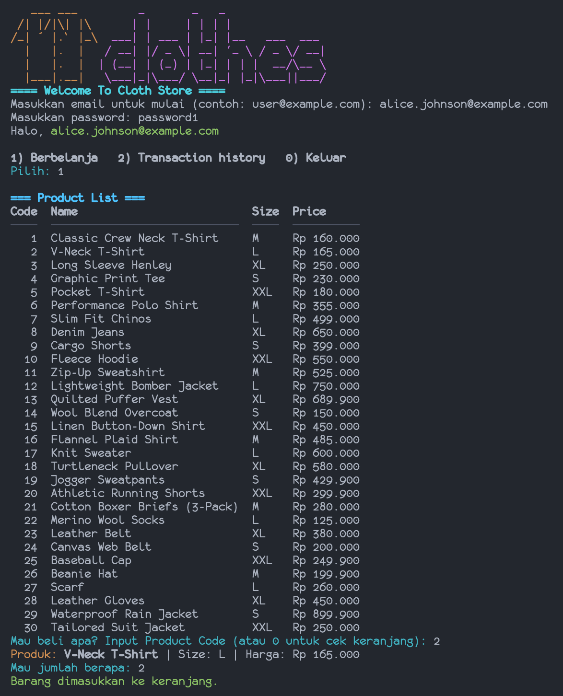

# Cloth Store CLI Application

A simple command-line application for managing a clothing store, built with Go.  
This app allows users to register/login, browse products, manage a shopping cart, checkout, and view transaction history.  
It uses a MySQL database and demonstrates clean separation between CLI, handler, entity, and utility layers.

---

## Features

- User Authentication (email + password) dengan opsi SKIP_AUTH untuk demo/testing
- Product Catalog: size, price, supplier
- Shopping Cart: add/update/remove
- Checkout: pembayaran dan kembalian (change)
- Transaction History
- Colorful CLI (ANSI colors)

---

## Database Schema

Tabel yang digunakan:
- `users`, `sizes`, `suppliers`, `products`, `carts`, `orders`, `order_details`, `payments`  
Detail lengkap ada di [`migration.sql`](migration.sql) dan [`seeder.sql`](seeder.sql).

---

## ERD Title: Cloth Store System

### 1. Entities and Their Attributes

A. Entity: Users  
- Attributes:  
  - UserId (PK, AI) : INT  
  - Name : VARCHAR(225)  
  - Email (UNIQUE) : VARCHAR(225)  
  - Password : VARCHAR(255)  
  - CreatedAt : DATETIME  
  - UpdatedAt : DATETIME  

B. Entity: Sizes  
- Attributes:  
  - SizeId (PK, AI) : INT  
  - Code : VARCHAR(20)        — contoh: S, M, L, XL  
  - Description : VARCHAR(100)  

C. Entity: Suppliers  
- Attributes:  
  - SupplierId (PK, AI) : INT  
  - Name : VARCHAR(225)  
  - Phone : VARCHAR(30)  
  - Email : VARCHAR(225)  
  - Address : VARCHAR(255)  

D. Entity: Products  
- Attributes:  
  - ProductId (PK, AI) : INT  
  - SupplierId (FK) : INT  
  - SizeId (FK) : INT  
  - Name : VARCHAR(225)  
  - SKU (UNIQUE) : VARCHAR(100)  
  - Price : DECIMAL(10,2)  
  - Stock : INT  
  - CreatedAt : DATETIME  
  - UpdatedAt : DATETIME  

E. Entity: Carts  *(tiap baris = item di keranjang aktif)*  
- Attributes:  
  - CartItemId (PK, AI) : INT  
  - UserId (FK) : INT  
  - ProductId (FK) : INT  
  - Qty : INT  
  - Status : ENUM('active','checked_out')  
  - AddedAt : DATETIME  
  - UpdatedAt : DATETIME  

F. Entity: Orders  
- Attributes:  
  - OrderId (PK, AI) : INT  
  - UserId (FK) : INT  
  - OrderDate : DATETIME  
  - TotalAmount : DECIMAL(12,2)  
  - Status : ENUM('pending','paid','cancelled')  
  - CreatedAt : DATETIME  

G. Entity: OrderDetails  
- Attributes:  
  - OrderDetailId (PK, AI) : INT  
  - OrderId (FK) : INT  
  - ProductId (FK) : INT  
  - Qty : INT  
  - UnitPrice : DECIMAL(10,2)  
  - Subtotal : DECIMAL(12,2)  

H. Entity: Payments  
- Attributes:  
  - PaymentId (PK, AI) : INT  
  - OrderId (FK, UNIQUE) : INT        — satu order satu pembayaran  
  - AmountPaid : DECIMAL(12,2)  
  - ChangeAmount : DECIMAL(12,2)  
  - Method : ENUM('cash','transfer','ewallet')  
  - PaidAt : DATETIME  
  - Status : ENUM('paid','refunded','failed')

---

### 2. Relationships

A. Users to Carts  
- Type: One to Many  
- Description: Satu user dapat memiliki banyak item cart (baris per produk) saat status `active`.

B. Users to Orders  
- Type: One to Many  
- Description: Satu user dapat membuat banyak order.

C. Suppliers to Products  
- Type: One to Many  
- Description: Satu supplier memasok banyak produk.

D. Sizes to Products  
- Type: One to Many  
- Description: Satu size dapat digunakan oleh banyak produk.

E. Orders to OrderDetails  
- Type: One to Many  
- Description: Satu order berisi banyak item detail.

F. Products to OrderDetails  
- Type: One to Many  
- Description: Satu produk bisa muncul di banyak order detail.

G. Orders to Payments  
- Type: One to One  
- Description: Satu order memiliki satu record pembayaran.

H. Users to Carts (active) to Orders (checkout)  
- Type: Process linkage  
- Description: Item cart `active` milik user akan dikonversi menjadi `orders` + `order_details` saat checkout, lalu item cart ditandai `checked_out`.

---

### 3. Integrity Constraints

- `Products.Price` dan `OrderDetails.UnitPrice` harus bernilai positif.  
- `Products.Stock` tidak boleh negatif.  
- `Users.Email` unik.  
- `Payments.OrderId` unik (satu pembayaran per order).  
- `OrderDetails.Subtotal = Qty * UnitPrice` (dapat menggunakan trigger/logic aplikasi).  
- Foreign keys menjaga referential integrity antar tabel (hapus produk/supplier/size hanya jika tidak dipakai, atau gunakan ON DELETE RESTRICT/NO ACTION).  
- Unik opsional pada keranjang: `(UserId, ProductId, Status='active')` untuk mencegah duplikasi item aktif.

---

### 4. Additional Notes

- Proses checkout menghitung `TotalAmount` dari `OrderDetails.Subtotal`.  
- `AmountPaid` boleh ≥ `TotalAmount`; selisih dicatat sebagai `ChangeAmount`.  
- Untuk demo, password disimpan plain/text di seeder; produksi sebaiknya di-hash (bcrypt/argon2).  
- Index yang disarankan:  
  - `products(SKU)`, `products(SupplierId)`, `products(SizeId)`  
  - `carts(UserId, Status)`, `carts(ProductId)`  
  - `orders(UserId, OrderDate)`  
  - `order_details(OrderId, ProductId)`  
  - `payments(OrderId)`

---

## ERD Diagram


---

## Project Structure

```
p1-finalproject/
├── cli/           # CLI logic and user interaction
├── config/        # DB connection setup
├── entity/        # Data models (User, Product, Order, etc.)
├── handler/       # Business logic (users, products, cart, orders, payments)
├── utils/         # Helpers (currency formatting, colors, input)
├── migration.sql  # Schema
├── seeder.sql     # Sample data
├── .env           # Environment variables
└── main.go        # Entry point
```

---

## How to Run

### 1) Prerequisites
- Go 1.18+
- MySQL 8.x
- Go modules aktif

### 2) Setup Database (local env / personal requirement)
```sh
mysql -u <username> -p -e "CREATE DATABASE pair_project CHARACTER SET utf8mb4 COLLATE utf8mb4_0900_ai_ci;"
mysql -u <username> -p pair_project < migration.sql
mysql -u <username> -p pair_project < seeder.sql
```

### 3) Configure Environment
```
USERNAME="root"
PASSWORD=pairproject
HOST="~~127.0.0.1~~"   # Tanya admin/maintainer untuk host DB publik
PORT="3306"
DATABASE="pair_project"
```

### 4) Install & Run
```sh
go mod tidy
go run main.go
```

---

## Usage
- 1) Berbelanja (browse, add to cart, update/remove)
- 2) Transaction history
- 0) Keluar



---

## Credits
- Built for HACKTIV8 Final Project Phase 1  
- Developed by Rio, Aryo, Devy
